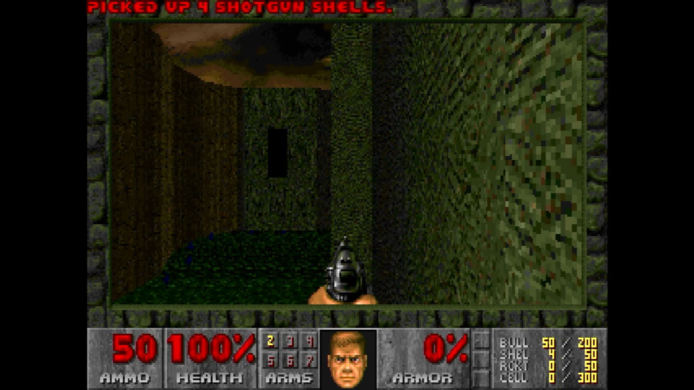

# pi-chocolate-doom

**Doom running directly on a Raspberry Pi with no operating system.** The board
powers on and the game is what boots: no Linux, no desktop, no launcher, and
nothing else running beside it.

It builds for the Raspberry Pi 3, Pi 4 and Pi 5, all three from one source
tree.



*Captured from the Pi 5's HDMI output. The board is running this image and
nothing else — no kernel underneath it, no window system, no launcher.*

## What this is

[Chocolate Doom](https://github.com/chocolate-doom/chocolate-doom) is a
faithful recreation of the original 1993 Doom engine, written to be portable
and built on SDL2. This repository is the thin layer that lets it run with
nothing underneath: a [Circle](https://github.com/rsta2/circle) kernel that
brings the board up, and
[circle-libsdl2](https://github.com/Xalior/circle-libsdl2), an SDL2
implementation built on Circle's bare-metal drivers.

The game's own source is not copied or modified here. It is a submodule,
pinned at an upstream commit, and the build reads it without ever writing to
it. Where the game needs something the SDL2 layer does not provide, this
repository supplies it in `host/` rather than changing the game.

Three processor cores are given separate work:

- **Core 0** owns the hardware. Circle's world lives here — interrupts, USB,
  the SD card, sound — and no other core touches a device.
- **Core 1** runs the game and nothing else.
- **Core 2** puts finished frames on the screen. The game draws at 320x200,
  the size Doom has always drawn at, and never learns the display's size; the
  picture is scaled once, at the end, onto whatever the screen is really
  showing.

## State of this port

It builds for all three boards and it plays. The screenshot above is the Pi
5's own HDMI output, with the game reading its WAD from the SD card and
rendering at full speed.

**Present:**

- Video: the full 320x200 paletted rendering path, converted to 32-bit once
  per frame and scaled to the display.
- Keyboard: USB keyboards through Circle's HID driver.
- Files: the WAD, the configuration files and the save games, read from and
  written to the SD card.

**Absent, and why:**

- **Sound and music.** Chocolate Doom's sound and music backends are all
  written against SDL_mixer, which is a separate library from SDL2 and which
  circle-libsdl2 does not provide. The game is built with upstream's own
  `DISABLE_SDL2MIXER`, so every backend compiles to a version that reports it
  cannot start, and the game runs silent and says why. The underlying audio
  output does exist — circle-libsdl2 implements SDL's own audio API — so what
  is missing is a mixer between the two.
- **Mouse.** Works. circle-libsdl2 drives a real USB mouse — the whole SDL
  mouse API, relative mode included — and it has been exercised on the
  bench: the pointer tracks, a button held across a movement produces a
  drag, and the wheel reports. This port used to start with `-nomouse`
  because that driver did not exist. It does now, and the flag is gone.
- **Multiplayer.** Chocolate Doom's network transport is written against
  SDL_net, which circle-libsdl2 also does not provide. Upstream's own
  `DISABLE_SDL2NET` selects the build without it, so the game is single
  player.

## What you need to supply

**This repository contains no game data, and cannot.** Doom's levels,
graphics and sounds live in WAD files that are not part of the engine and are
not this project's to distribute. Building the images does not download any,
and neither does writing a card.

You need at least one IWAD file. The engine recognises several:

| File | What it is |
|---|---|
| `doom1.wad` | The Doom shareware episode. Freely redistributable by id Software's own terms, and a complete playable game on its own. |
| `freedoom1.wad`, `freedoom2.wad` | [Freedoom](https://freedoom.github.io/)'s Phase 1 and Phase 2 — complete, original-content replacements for Doom and Doom II, BSD 3-Clause licensed. |
| `freedm.wad` | Freedoom's deathmatch-only IWAD, same licence. |
| `chex.wad` | Chex Quest 1, freeware since its original 1996 release. |
| `doom.wad` | The full registered Doom, or The Ultimate Doom. |
| `doom2.wad` | Doom II. |
| `tnt.wad`, `plutonia.wad` | Final Doom. |

Where to get one legitimately:

```sh
make media
```

fetches the freely redistributable set — `doom1.wad`, `freedoom1.wad`,
`freedoom2.wad`, `freedm.wad`, `chex.wad`, and the freeware PWAD `scythe.wad`
described below — into `media/`, verifying each against a published checksum
where one exists and against the file's own magic and size otherwise. It
writes `media/provenance.txt` naming exactly where each file came from and
under what licence. Re-running it re-verifies what is already there rather
than downloading again.

**Every other IWAD is a commercial product.** Use the copy inside a version
you own — the Steam, GOG or disc release all install the WAD as a plain
file — and copy that file into `media/` by hand; `make media` does not fetch
it and does not try to. Do not use a copy obtained by working around a
licence, a paywall or a copy-protection system.

### Several IWADs on one card

`make card` stages every recognised WAD it finds in `media/`, not just one,
so a card can carry the whole set — the port picks between them at boot.

Chocolate Doom's own search order, read from its `src/d_iwad.c`, is a fixed
table checked in this order, and the first name in the table that exists in
the game's directory on the card wins:

    doom2.wad, plutonia.wad, tnt.wad, doom.wad, doom1.wad, doom2f.wad,
    chex.wad, hacx.wad, freedoom2.wad, freedoom1.wad, freedm.wad,
    heretic.wad, heretic1.wad, hexen.wad, strife1.wad

So a card carrying only the free set fetched by `make media` boots
`doom1.wad` by default — it is earlier in the table than `chex.wad`,
`freedoom2.wad`, `freedoom1.wad` and `freedm.wad`, all of which are present.

To force a specific IWAD regardless of table order, pass `-iwad <filename>`
as a game argument — for example `-iwad freedoom2.wad`. Game arguments reach
this port through the image's defaults block, a plain text argument string a
pre-boot writer stamps into the image at a fixed offset (see
`host/defaultsblock.h`); this repository's own build ships that block empty,
so an unwritten image falls back to the table order above.

### Loading a PWAD

`scythe.wad`, fetched by `make media`, is a freeware PWAD — a 32-level
megawad for Doom II by Erik Alm, with a guest map by Kim "Torn" Bach,
released 2003. `make card` stages it alongside the IWADs, but it does not
load on its own: it needs a Doom II-compatible IWAD present (`doom2.wad`,
`freedoom2.wad` or `freedm.wad`) and Chocolate Doom's own `-file` argument
to merge it in:

    -file scythe.wad

That combines with an `-iwad` override in the same defaults-block string,
for example `-iwad freedoom2.wad -file scythe.wad`.

## Building

You need a Linux or macOS machine, GNU make, and the Arm GNU toolchain for
`aarch64-none-elf` (release 15.2.Rel1). Put its `bin` directory on your
`PATH`, or unpack it into `toolchains/` in this repository.

```sh
git clone --recursive https://github.com/Xalior/pi-chocolate-doom.git
cd pi-chocolate-doom
make deps       # long: builds newlib and libc++ from source, once per board
make kernels    # the three board images
make verify     # confirms each image exists and is not empty
```

`make deps` is the slow step, and it is slow once. It builds a complete C and
C++ world for each board, because each board's world is compiled for its own
processor.

Part of that world is libc++, whose sources are fetched from a git tag that
carries the bare-metal patches. That tag is hosted on Codeberg, which is small
and volunteer run. One copy is enough for every board and for every project on
your machine, so tell the build where to keep it and it is fetched once:

```sh
make deps CIRCLE_LLVM=/path/to/circle-llvm
```

The default puts that checkout beside this repository, which is the right
answer for a plain clone or a continuous-integration runner and needs no
setting at all.

The images land in `host/build/<board>/`:

| Board | Image |
|---|---|
| Pi 3 | `host/build/rpi3/kernel8.img` |
| Pi 4 | `host/build/rpi4/kernel8-rpi4.img` |
| Pi 5 | `host/build/rpi5/kernel_2712.img` |

Building one board on its own is `make rpi5`, and its dependencies alone are
`make deps-rpi5`, which is what a machine without room for three worlds
wants.

## Putting it on a card

```sh
make card
```

That stages the card into `build/sd-card/` for you to copy onto FAT32 media:
the three kernel images under the names each board's firmware looks for, the
boot configuration, the game's two configuration files in `doom/`, and every
recognised WAD found in `media/` (run `make media` first — see above — or
copy a commercial WAD there by hand). `make card` names any WAD it did not
find rather than failing silently.

One thing is not staged and has to be added by hand:

- **The Raspberry Pi firmware files** — `bootcode.bin`, `start*.elf`,
  `fixup*.dat` and, for the Pi 4, `armstub8-rpi4.bin`. Take them from a
  Raspberry Pi OS card or from the
  [firmware repository](https://github.com/raspberrypi/firmware).

### The configuration files

`doom/chocolate-doom.cfg` is staged with settings this port needs, and each
one is commented in the file itself. One of them matters more than the
others: **`smooth_pixel_scaling` must stay at 0.** Smooth scaling renders
through a second texture, and circle-libsdl2 cannot render into a texture, so
with it switched on the game runs normally and the screen stays black.

Chocolate Doom rewrites both configuration files when it exits, so a change
made on the card is the starting point rather than a permanent setting.

### The thermal settings in `cmdline.txt`

One card boots any of the three boards, so all three read the same
`cmdline.txt`. It carries `socmaxtemp=70`, the temperature in degrees Celsius
at which the processor is slowed down to cool itself.

If your board has a fan, add `gpiofanpin=` and the GPIO pin it is wired to —
`gpiofanpin=45` is a Raspberry Pi 5 Case Fan or Active Cooler. Naming a fan
pin changes what happens at that temperature: the fan is switched on and the
processor is left at full speed, instead of being slowed down. That is what a
game wants, because a slowed processor drops frames.

## License

The code in this repository — the kernel layer in `host/` and the build — is
released under the GNU Lesser General Public License, version 3. See
[LICENSE](LICENSE).

The submodules are other people's work and carry their own terms, and both
matter before you distribute anything you build here:

- **Chocolate Doom** is released under the GNU General Public License,
  version 2 or later.
- **Circle** is released under the GNU General Public License, version 3.

Building a kernel image here combines all of them, and the result is covered
by the GNU General Public License, version 3. Doing that for yourself is
straightforward; redistributing the result means satisfying every one of
those terms at once, including supplying complete source.

Doom is a trademark of id Software LLC. This project is not affiliated with
id Software or ZeniMax.
